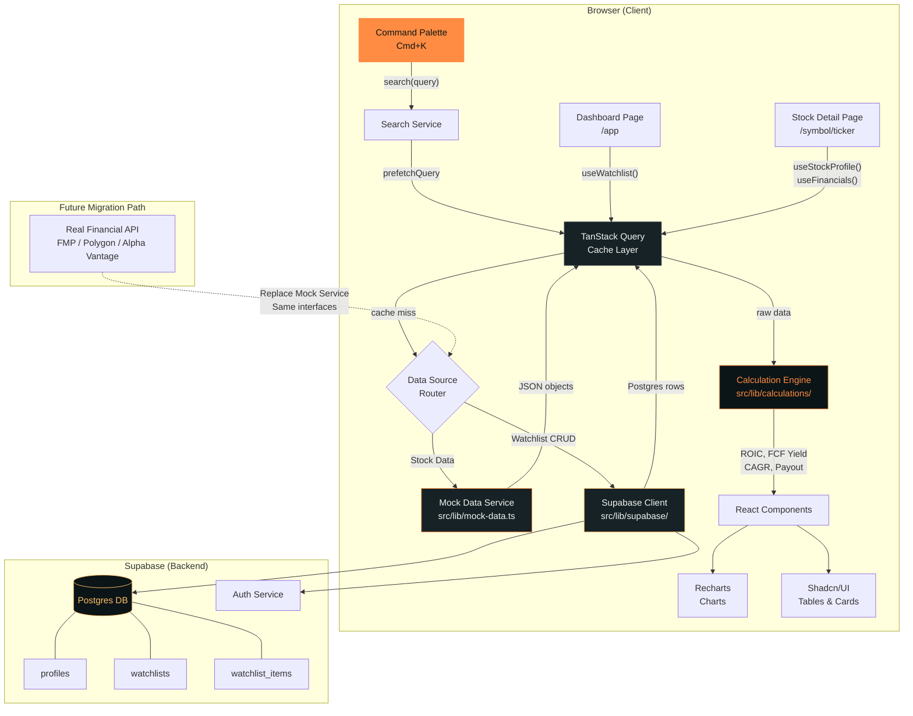
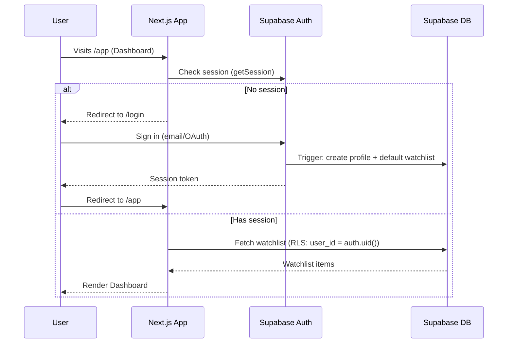

# HUNTR — ARCHITECTURE.md
# Fuente de Verdad Inmutable v1.0

> **"The Wolf of Value Street"** — Plataforma SaaS de análisis financiero con estética táctica.
> Clon funcional de Qualtrim con identidad visual propia.

---

## 1. TECH STACK & THEME

### 1.1 Core Stack

| Capa            | Tecnología                         | Versión / Nota                              |
| --------------- | ---------------------------------- | ------------------------------------------- |
| Framework       | Next.js                            | 15 (App Router, Server Components)          |
| Language        | TypeScript                         | Strict mode (`strict: true`)                |
| Styling         | Tailwind CSS                       | v4+ con tokens semánticos Wolf Palette      |
| UI Components   | Shadcn/UI                          | Base components, customizados al tema       |
| Charts          | Recharts                           | Gradientes naranja, tooltips oscuros        |
| Data Fetching   | TanStack Query (React Query)       | v5 — cache, prefetch, stale-while-revalidate|
| Auth & DB       | Supabase                           | Auth (email/OAuth) + Postgres               |
| Search UX       | cmdk (pacifico/cmdk)               | Command palette Cmd+K                       |
| Fonts           | Satoshi + Geist Mono               | Via `next/font/local` o Google Fonts        |

### 1.2 Tailwind Theme Extension — Wolf Palette

```typescript
// tailwind.config.ts — extend.colors
const wolfPalette = {
  // Backgrounds
  'wolf-black':    '#0B1416',  // Deep Forest Night — fondo principal
  'wolf-surface':  '#162225',  // Midnight Rock — cards, paneles
  'wolf-border':   '#2A3B40',  // Border sutil para cards

  // Accents
  'sunset-orange': '#FF8C42',  // Primary CTA, bullish, gráficos alcistas
  'golden-hour':   '#FFBF69',  // Alertas, highlights, badges

  // Text
  'snow-peak':     '#F2F4F3',  // Texto primario — legibilidad máxima
  'mist':          '#8C9DA1',  // Texto secundario — labels, metadata

  // Semantic (bearish NO es rojo)
  'bearish':       '#5A7A8A',  // Azul-gris apagado para bajadas
} as const;
```

**Regla Anti-Convencional:** `sunset-orange` = bullish/subida. `bearish` (#5A7A8A) = bajada. Nunca verde/rojo estándar.

### 1.3 Typography Tokens

```css
/* globals.css */
:root {
  --font-heading: 'Satoshi', 'Outfit', sans-serif;
  --font-mono: 'Geist Mono', 'JetBrains Mono', monospace;
}
```

- **Headings & UI:** `font-heading` — Sans-serif con carácter.
- **Datos financieros:** `font-mono` con `font-variant-numeric: tabular-nums` — alineación perfecta en tablas.

---

## 2. DOMAIN MODEL

### 2.1 Supabase Database Schema

```sql
-- ============================================================
-- HUNTR DATABASE SCHEMA (Supabase / Postgres)
-- ============================================================

-- Profiles (extends Supabase auth.users)
CREATE TABLE public.profiles (
  id          UUID PRIMARY KEY REFERENCES auth.users(id) ON DELETE CASCADE,
  username    TEXT UNIQUE,
  avatar_url  TEXT,
  created_at  TIMESTAMPTZ DEFAULT now(),
  updated_at  TIMESTAMPTZ DEFAULT now()
);

-- Row Level Security
ALTER TABLE public.profiles ENABLE ROW LEVEL SECURITY;
CREATE POLICY "Users can view own profile"
  ON public.profiles FOR SELECT USING (auth.uid() = id);
CREATE POLICY "Users can update own profile"
  ON public.profiles FOR UPDATE USING (auth.uid() = id);

-- Watchlists
CREATE TABLE public.watchlists (
  id          UUID PRIMARY KEY DEFAULT gen_random_uuid(),
  user_id     UUID NOT NULL REFERENCES auth.users(id) ON DELETE CASCADE,
  name        TEXT NOT NULL DEFAULT 'My Watchlist',
  created_at  TIMESTAMPTZ DEFAULT now(),
  updated_at  TIMESTAMPTZ DEFAULT now()
);

ALTER TABLE public.watchlists ENABLE ROW LEVEL SECURITY;
CREATE POLICY "Users can CRUD own watchlists"
  ON public.watchlists FOR ALL USING (auth.uid() = user_id);

-- Watchlist Items (join table: watchlist <-> ticker)
CREATE TABLE public.watchlist_items (
  id            UUID PRIMARY KEY DEFAULT gen_random_uuid(),
  watchlist_id  UUID NOT NULL REFERENCES public.watchlists(id) ON DELETE CASCADE,
  ticker        TEXT NOT NULL,
  added_at      TIMESTAMPTZ DEFAULT now(),
  UNIQUE(watchlist_id, ticker)
);

ALTER TABLE public.watchlist_items ENABLE ROW LEVEL SECURITY;
CREATE POLICY "Users can CRUD own watchlist items"
  ON public.watchlist_items FOR ALL
  USING (
    EXISTS (
      SELECT 1 FROM public.watchlists w
      WHERE w.id = watchlist_items.watchlist_id
        AND w.user_id = auth.uid()
    )
  );

-- Trigger: auto-create default watchlist on user signup
CREATE OR REPLACE FUNCTION public.handle_new_user()
RETURNS TRIGGER AS $$
BEGIN
  INSERT INTO public.profiles (id) VALUES (NEW.id);
  INSERT INTO public.watchlists (user_id, name) VALUES (NEW.id, 'My Watchlist');
  RETURN NEW;
END;
$$ LANGUAGE plpgsql SECURITY DEFINER;

CREATE TRIGGER on_auth_user_created
  AFTER INSERT ON auth.users
  FOR EACH ROW EXECUTE FUNCTION public.handle_new_user();
```

### 2.2 Mock Data — TypeScript Interfaces

```typescript
// src/types/stock.ts

export interface StockProfile {
  ticker: string;               // 'AAPL'
  name: string;                 // 'Apple Inc.'
  sector: string;               // 'Technology'
  industry: string;             // 'Consumer Electronics'
  exchange: string;             // 'NASDAQ'
  currency: string;             // 'USD'
  country: string;              // 'US'
  description: string;          // Company description (1-2 sentences)
  logo_url: string;             // Placeholder or CDN URL
  website: string;
}

export interface StockQuote {
  ticker: string;
  price: number;                // Current stock price
  market_cap: number;           // In raw number (e.g., 3_000_000_000_000)
  shares_outstanding: number;   // Diluted shares
  pe_ratio: number;             // Trailing P/E (pre-calculated, common data point)
  dividend_yield: number;       // Annual % (0.0055 = 0.55%)
  fifty_two_week_high: number;
  fifty_two_week_low: number;
  avg_volume: number;
  beta: number;
}
```

```typescript
// src/types/financials.ts

export type PeriodType = 'annual' | 'quarterly';

export interface FinancialPeriod {
  period: string;               // 'FY2024' | 'FY2023' | 'Q3 2024' | 'Q2 2024'
  date: string;                 // '2024-09-28' (fiscal year end date)
  currency: string;             // 'USD'
}

export interface IncomeStatement extends FinancialPeriod {
  revenue: number;
  cost_of_revenue: number;
  gross_profit: number;
  operating_expenses: number;
  operating_income: number;
  interest_expense: number;
  pre_tax_income: number;
  income_tax: number;
  net_income: number;
  eps_basic: number;
  eps_diluted: number;
  shares_outstanding_basic: number;
  shares_outstanding_diluted: number;
  ebitda: number;
  // Derived in frontend: gross_margin, operating_margin, net_margin
}

export interface BalanceSheet extends FinancialPeriod {
  cash_and_equivalents: number;
  short_term_investments: number;
  total_current_assets: number;
  total_non_current_assets: number;
  total_assets: number;
  total_current_liabilities: number;
  long_term_debt: number;
  total_non_current_liabilities: number;
  total_liabilities: number;
  total_equity: number;
  retained_earnings: number;
  shares_outstanding: number;
  // Derived in frontend: debt_to_equity, current_ratio, book_value_per_share
}

export interface CashFlowStatement extends FinancialPeriod {
  operating_cash_flow: number;
  capital_expenditures: number;  // Negative number
  free_cash_flow: number;        // OCF + CapEx
  dividends_paid: number;        // Negative number
  share_repurchases: number;     // Negative number (buybacks)
  net_investing: number;
  net_financing: number;
  net_change_in_cash: number;
  // Derived in frontend: FCF yield, payout ratio, capex_to_revenue
}

export interface CompanyFinancials {
  ticker: string;
  income_statement: {
    annual: IncomeStatement[];    // 10 years: FY2015..FY2024
    quarterly: IncomeStatement[]; // 8 quarters: Q1 2023..Q4 2024
  };
  balance_sheet: {
    annual: BalanceSheet[];
    quarterly: BalanceSheet[];
  };
  cash_flow: {
    annual: CashFlowStatement[];
    quarterly: CashFlowStatement[];
  };
}
```

```typescript
// src/types/watchlist.ts

export interface Watchlist {
  id: string;
  user_id: string;
  name: string;
  created_at: string;
  items: WatchlistItem[];
}

export interface WatchlistItem {
  id: string;
  watchlist_id: string;
  ticker: string;
  added_at: string;
  // Enriched in frontend via mock data join:
  profile?: StockProfile;
  quote?: StockQuote;
}
```

### 2.3 Mock Data Universe — Tickers

| Ticker | Company              | Sector               | Why included                             |
| ------ | -------------------- | -------------------- | ---------------------------------------- |
| AAPL   | Apple Inc.           | Technology           | Mega-cap benchmark, buybacks masivos     |
| MSFT   | Microsoft Corp.      | Technology           | SaaS margins, growth + dividends         |
| GOOGL  | Alphabet Inc.        | Communication        | Zero dividends, alta caja                |
| AMZN   | Amazon.com Inc.      | Consumer Cyclical    | FCF machine, CapEx intensivo             |
| NVDA   | NVIDIA Corp.         | Technology           | Hypergrowth, testing escala de gráficos  |
| META   | Meta Platforms       | Communication        | Buybacks + nuevo dividendo               |
| TSLA   | Tesla Inc.           | Consumer Cyclical    | Volatilidad, sin dividendo, P/E extremo  |
| JPM    | JPMorgan Chase       | Financial Services   | Estructura de capital bancaria           |
| JNJ    | Johnson & Johnson    | Healthcare           | Dividend aristocrat, estabilidad         |
| KO     | Coca-Cola Co.        | Consumer Defensive   | Dividend king, growth lento pero seguro  |
| COST   | Costco Wholesale     | Consumer Defensive   | Márgenes bajos, alta rotación            |
| V      | Visa Inc.            | Financial Services   | Márgenes obscenamente altos (~65% net)   |
| O      | Realty Income Corp.  | Real Estate (REIT)   | FFO > Net Income, dividendos mensuales   |

**Regla de Mock Data:** Cada ticker tendrá **10 años de data anual (FY2015–FY2024)** y **8 trimestres (Q1 2023–Q4 2024)**. Los números deben ser coherentes internamente (ej: `gross_profit = revenue - cost_of_revenue`).

### 2.4 Frontend Calculation Utilities

Estas funciones TypeScript puras se ubicarán en `src/lib/calculations/`:

```typescript
// src/lib/calculations/roic.ts
/**
 * ROIC = NOPAT / Invested Capital
 * NOPAT = Operating Income × (1 - Tax Rate)
 * Invested Capital = Total Equity + Total Debt - Cash
 *
 * @param operating_income  - From Income Statement
 * @param income_tax        - From Income Statement
 * @param pre_tax_income    - From Income Statement (to derive effective tax rate)
 * @param total_equity      - From Balance Sheet
 * @param long_term_debt    - From Balance Sheet
 * @param cash              - cash_and_equivalents from Balance Sheet
 */
export function calculateROIC(...): number;

// src/lib/calculations/fcf-yield.ts
/**
 * FCF Yield = Free Cash Flow / Market Cap
 * Market Cap = Price × Shares Outstanding
 */
export function calculateFCFYield(
  free_cash_flow: number,
  price: number,
  shares_outstanding: number,
): number;

// src/lib/calculations/payout-ratio.ts
/**
 * Payout Ratio = Dividends Paid / Net Income
 * (Positive result even though dividends_paid is negative in CF)
 */
export function calculatePayoutRatio(
  dividends_paid: number,
  net_income: number,
): number;

// src/lib/calculations/cagr.ts
/**
 * CAGR = (End Value / Start Value)^(1/years) - 1
 * Supports 3Y, 5Y, 10Y windows.
 */
export function calculateCAGR(
  values: number[],    // Array ordered chronologically
  years: 3 | 5 | 10,
): number | null;       // null if insufficient data
```

---

## 3. SYSTEM DESIGN

### 3.1 Data Flow Architecture



### 3.2 Data Fetching Strategy (TanStack Query)

| Hook                     | Source       | Stale Time | Cache Key                           | Notes                          |
| ------------------------ | ------------ | ---------- | ----------------------------------- | ------------------------------ |
| `useStockProfile(t)`     | Mock Service | ∞ (static) | `['stock', 'profile', ticker]`      | Never refetches (mock)         |
| `useStockQuote(t)`       | Mock Service | 30s        | `['stock', 'quote', ticker]`        | Simulates "live" data          |
| `useFinancials(t, type)` | Mock Service | ∞ (static) | `['financials', ticker, type]`      | `type = 'annual' \| 'quarterly'` |
| `useWatchlist()`         | Supabase     | 60s        | `['watchlist', userId]`             | Requires auth                  |
| `useSearch(q)`           | Mock Service | ∞ (static) | `['search', query]`                 | Client-side filter over all profiles |

**Prefetch en Cmd+K:** Al hacer hover o navegar con teclado sobre un resultado, se ejecuta `queryClient.prefetchQuery(['stock', 'profile', ticker])` + `prefetchQuery(['stock', 'quote', ticker])` para que la transición a `/symbol/[ticker]` sea instantánea.

### 3.3 Auth Flow



**Nota:** Las páginas `/` (Landing) y `/symbol/[ticker]` (Detalle) son **públicas**. Solo `/app` (Dashboard/Watchlist) requiere autenticación.

---

## 4. PROJECT STRUCTURE

```
huntr/
├── public/
│   ├── fonts/                        # Satoshi, Geist Mono (self-hosted)
│   └── images/
│       └── wolf-logo.svg             # Brand logo
│
├── src/
│   ├── app/
│   │   ├── layout.tsx                # Root layout (fonts, theme, providers)
│   │   ├── globals.css               # Tailwind directives, CSS vars, base styles
│   │   ├── page.tsx                  # Landing page — / (public)
│   │   │
│   │   ├── (auth)/                   # Auth route group (public, no sidebar)
│   │   │   ├── login/
│   │   │   │   └── page.tsx
│   │   │   └── signup/
│   │   │       └── page.tsx
│   │   │
│   │   ├── (platform)/               # Authenticated route group
│   │   │   ├── layout.tsx            # Platform layout (sidebar, topbar, Cmd+K)
│   │   │   ├── app/
│   │   │   │   └── page.tsx          # Dashboard — /app (watchlist)
│   │   │   └── symbol/
│   │   │       └── [ticker]/
│   │   │           ├── layout.tsx    # Ticker header + tab navigation
│   │   │           ├── page.tsx      # Overview tab (default)
│   │   │           ├── financials/
│   │   │           │   └── page.tsx  # Financials tab
│   │   │           ├── valuation/
│   │   │           │   └── page.tsx  # Valuation tab
│   │   │           └── dividends/
│   │   │               └── page.tsx  # Dividends tab
│   │   │
│   │   └── not-found.tsx             # Custom 404
│   │
│   ├── components/
│   │   ├── ui/                       # Shadcn/UI primitives (Button, Card, Badge, etc.)
│   │   ├── layout/
│   │   │   ├── sidebar.tsx           # Platform sidebar navigation
│   │   │   ├── topbar.tsx            # Top bar with search trigger
│   │   │   └── footer.tsx            # Landing footer
│   │   ├── search/
│   │   │   ├── command-palette.tsx   # Cmd+K dialog (cmdk library)
│   │   │   └── search-result.tsx     # Individual search result row
│   │   ├── stock/
│   │   │   ├── stock-header.tsx      # Ticker hero (name, price, change)
│   │   │   ├── stock-tabs.tsx        # Tab navigation (Overview, Financials…)
│   │   │   ├── key-metrics-grid.tsx  # Grid of KPI cards (P/E, ROIC, etc.)
│   │   │   └── price-chart.tsx       # Mini price chart (overview)
│   │   ├── financials/
│   │   │   ├── financial-table.tsx   # Responsive data table (annual/quarterly toggle)
│   │   │   ├── period-toggle.tsx     # Annual ↔ Quarterly switch
│   │   │   └── metric-chart.tsx      # Individual metric trend chart
│   │   ├── valuation/
│   │   │   ├── valuation-metrics.tsx # P/E, P/S, EV/EBITDA cards
│   │   │   └── historical-pe.tsx     # Historical P/E chart
│   │   ├── dividends/
│   │   │   ├── dividend-summary.tsx  # Yield, payout, frequency
│   │   │   └── dividend-history.tsx  # Dividend per share over time chart
│   │   ├── watchlist/
│   │   │   ├── watchlist-table.tsx   # Main watchlist data table
│   │   │   ├── add-to-watchlist.tsx  # "+" button / action
│   │   │   └── empty-state.tsx       # "Start hunting" empty watchlist
│   │   ├── charts/
│   │   │   ├── area-chart.tsx        # Recharts area with orange gradient
│   │   │   ├── bar-chart.tsx         # Recharts bar chart themed
│   │   │   └── chart-tooltip.tsx     # Custom dark tooltip (#0B1416)
│   │   └── landing/
│   │       ├── hero.tsx              # Wolf hero section
│   │       ├── features.tsx          # Feature grid
│   │       └── cta.tsx               # Call to action
│   │
│   ├── lib/
│   │   ├── mock-data.ts              # Main entry: exports all mock service functions
│   │   ├── mock-data/
│   │   │   ├── profiles.ts           # StockProfile[] for 13 tickers
│   │   │   ├── quotes.ts             # StockQuote[] for 13 tickers
│   │   │   ├── financials/
│   │   │   │   ├── aapl.ts           # CompanyFinancials for AAPL
│   │   │   │   ├── msft.ts           # CompanyFinancials for MSFT
│   │   │   │   ├── googl.ts          # ...
│   │   │   │   ├── amzn.ts
│   │   │   │   ├── nvda.ts
│   │   │   │   ├── meta.ts
│   │   │   │   ├── tsla.ts
│   │   │   │   ├── jpm.ts
│   │   │   │   ├── jnj.ts
│   │   │   │   ├── ko.ts
│   │   │   │   ├── cost.ts
│   │   │   │   ├── v.ts
│   │   │   │   ├── o.ts
│   │   │   │   └── index.ts          # Barrel export: Record<string, CompanyFinancials>
│   │   │   └── search-index.ts       # Pre-built search index (ticker + name + aliases)
│   │   ├── calculations/
│   │   │   ├── index.ts              # Barrel export
│   │   │   ├── roic.ts               # calculateROIC()
│   │   │   ├── fcf-yield.ts          # calculateFCFYield()
│   │   │   ├── payout-ratio.ts       # calculatePayoutRatio()
│   │   │   ├── cagr.ts               # calculateCAGR()
│   │   │   └── margins.ts            # calculateGrossMargin(), calculateNetMargin(), etc.
│   │   ├── supabase/
│   │   │   ├── client.ts             # createBrowserClient()
│   │   │   ├── server.ts             # createServerClient() for RSC
│   │   │   ├── middleware.ts          # Auth middleware helper
│   │   │   └── types.ts              # Generated DB types (supabase gen types)
│   │   ├── utils.ts                  # cn() (clsx+twMerge), formatCurrency(), formatPercent()
│   │   └── constants.ts              # App-wide constants (routes, feature flags)
│   │
│   ├── hooks/
│   │   ├── use-stock-profile.ts      # TanStack Query: fetch stock profile
│   │   ├── use-stock-quote.ts        # TanStack Query: fetch stock quote
│   │   ├── use-financials.ts         # TanStack Query: fetch financials (annual/quarterly)
│   │   ├── use-watchlist.ts          # TanStack Query + Supabase: CRUD watchlist
│   │   ├── use-search.ts             # Debounced search over mock data
│   │   └── use-keyboard-shortcut.ts  # Generic keyboard shortcut hook
│   │
│   ├── providers/
│   │   ├── query-provider.tsx        # TanStack QueryClientProvider
│   │   ├── supabase-provider.tsx     # Supabase session context
│   │   └── theme-provider.tsx        # (Optional) dark mode toggle context
│   │
│   └── types/
│       ├── stock.ts                  # StockProfile, StockQuote
│       ├── financials.ts             # IncomeStatement, BalanceSheet, CashFlowStatement, CompanyFinancials
│       ├── watchlist.ts              # Watchlist, WatchlistItem
│       └── database.ts              # Supabase generated types (re-export)
│
├── supabase/
│   ├── migrations/
│   │   └── 001_initial_schema.sql    # The SQL from section 2.1
│   └── config.toml                   # Supabase local config
│
├── .env.local.example                # Template: NEXT_PUBLIC_SUPABASE_URL, ANON_KEY
├── .github/
│   └── copilot-instructions.md
├── CONTEXT.md
├── DESIGN_SYSTEM.md
├── ARCHITECTURE.md                   # ← This file (Source of Truth)
├── tailwind.config.ts
├── tsconfig.json
├── next.config.ts
├── package.json
└── README.md
```

---

## 5. IMPLEMENTATION PLAN — Phased Roadmap

### FASE 0: Scaffolding & Theme Foundation
**Objetivo:** Proyecto compilable con el tema Wolf Palette aplicado.

| #   | Task                                           | Output                                         |
| --- | ---------------------------------------------- | ---------------------------------------------- |
| 0.1 | `npx create-next-app@latest` con TypeScript, Tailwind, App Router | Proyecto base funcional                |
| 0.2 | Instalar dependencias: `shadcn/ui`, `recharts`, `@tanstack/react-query`, `@supabase/supabase-js`, `cmdk` | `package.json` actualizado |
| 0.3 | Configurar `tailwind.config.ts` con Wolf Palette tokens | Colores custom disponibles como `bg-wolf-black` |
| 0.4 | Configurar fuentes (Satoshi + Geist Mono) via `next/font` | `layout.tsx` con font variables              |
| 0.5 | Configurar Shadcn/UI con tema oscuro customizado | Componentes base con colores Wolf              |
| 0.6 | Crear `globals.css` con reset, CSS variables, base styles | Estilo base dark mode                        |
| 0.7 | Crear providers (`QueryProvider`, `SupabaseProvider`) | `app/layout.tsx` wrapping providers           |
| 0.8 | Setup Supabase: `.env.local`, client/server helpers | Conexión a Supabase funcional                  |

**Gate:** La app arranca en `localhost:3000` con fondo `#0B1416` y un text en `#F2F4F3`.

---

### FASE 1: Mock Data Engine
**Objetivo:** Servicio de datos financieros mock completamente tipado y realista.

| #   | Task                                           | Output                                         |
| --- | ---------------------------------------------- | ---------------------------------------------- |
| 1.1 | Definir tipos TypeScript (`types/stock.ts`, `types/financials.ts`) | Interfaces inmutables                    |
| 1.2 | Crear `mock-data/profiles.ts` — 13 stock profiles | Array de StockProfile                         |
| 1.3 | Crear `mock-data/quotes.ts` — 13 stock quotes   | Array de StockQuote con datos realistas        |
| 1.4 | Crear financials para cada ticker (10Y annual + 8Q) | 13 archivos en `mock-data/financials/`       |
| 1.5 | Crear `mock-data.ts` — Service layer con funciones: `getStockProfile()`, `getStockQuote()`, `getFinancials()`, `searchStocks()` | API-like interface |
| 1.6 | Crear `mock-data/search-index.ts` — índice de búsqueda | Fuzzy-search ready data structure             |
| 1.7 | Implementar calculation utilities: `roic.ts`, `fcf-yield.ts`, `payout-ratio.ts`, `cagr.ts`, `margins.ts` | Funciones puras testeables |
| 1.8 | Crear TanStack Query hooks: `useStockProfile`, `useStockQuote`, `useFinancials`, `useSearch` | Hooks reutilizables |

**Gate:** `getFinancials('AAPL')` retorna 10 años de Income Statement + Balance Sheet + Cash Flow con números coherentes. `calculateROIC()` produce un resultado correcto.

---

### FASE 2: Platform Shell & Dashboard
**Objetivo:** Layout de plataforma con sidebar, Cmd+K y Watchlist funcional.

| #   | Task                                           | Output                                         |
| --- | ---------------------------------------------- | ---------------------------------------------- |
| 2.1 | Crear `(platform)/layout.tsx` — sidebar + topbar | Shell de navegación con estética táctica       |
| 2.2 | Implementar Cmd+K command palette (`cmdk`)      | Búsqueda instantánea con navegación por teclado |
| 2.3 | Implementar prefetch en search results (hover/arrow) | Transiciones instantáneas a detalle          |
| 2.4 | Supabase Auth: Login/Signup pages               | Flujo completo de auth con redirect            |
| 2.5 | DB Migration: ejecutar schema SQL en Supabase    | Tablas `profiles`, `watchlists`, `watchlist_items` |
| 2.6 | Implementar `useWatchlist()` hook (CRUD)         | Add/remove tickers de la watchlist             |
| 2.7 | Crear `/app` Dashboard page — Watchlist table    | Tabla con ticker, nombre, precio, métricas clave |
| 2.8 | Empty state: "Start Hunting" cuando watchlist vacía | UX de onboarding                             |

**Gate:** Un usuario se registra, ve su watchlist vacía, busca "AAPL" con Cmd+K, lo agrega, y ve la tabla actualizada con datos del mock.

---

### FASE 3: Stock Detail — The Hunter's View
**Objetivo:** Página `/symbol/[ticker]` completa con 4 tabs.

| #   | Task                                           | Output                                         |
| --- | ---------------------------------------------- | ---------------------------------------------- |
| 3.1 | Crear `[ticker]/layout.tsx` — Stock header + tabs | Ticker hero (nombre, precio, cambio) + tab nav |
| 3.2 | **Overview tab** (`page.tsx`): Key metrics grid, mini price chart, company description | Vista resumen como Qualtrim |
| 3.3 | **Financials tab**: Income Statement table con Annual/Quarterly toggle | Tabla responsive con `font-mono tabular-nums` |
| 3.4 | Financials tab: Balance Sheet + Cash Flow sub-tabs o accordion | Los 3 estados financieros navegables          |
| 3.5 | Financials tab: Metric trend charts (Revenue, Net Income, FCF) | Recharts con gradiente naranja               |
| 3.6 | **Valuation tab**: P/E, P/S, P/B, EV/EBITDA, ROIC, FCF Yield cards | Métricas calculadas en frontend   |
| 3.7 | Valuation tab: Historical P/E chart (10Y)       | Área chart con línea media                     |
| 3.8 | Valuation tab: CAGR indicators (Revenue, EPS, FCF) 3Y/5Y/10Y | Badges con calculateCAGR()          |
| 3.9 | **Dividends tab**: Yield, Payout Ratio, Frequency, DPS history | Gráfico + resumen                    |
| 3.10| "Add to Watchlist" button integrado en stock header | CTA con estado auth-aware                    |

**Gate:** Navegar a `/symbol/AAPL` muestra los 4 tabs completamente funcionales con datos del mock. `/symbol/O` (Realty Income) muestra datos de REIT coherentes.

---

### FASE 4: Landing Page & Polish
**Objetivo:** First impression y refinamiento de toda la UX.

| #   | Task                                           | Output                                         |
| --- | ---------------------------------------------- | ---------------------------------------------- |
| 4.1 | Landing page `/` — Hero con Wolf branding       | Hero sección impactante, CTA a `/app`          |
| 4.2 | Landing page — Features section                  | Grid de beneficios (análisis, watchlist, etc.) |
| 4.3 | Responsive audit: mobile + tablet breakpoints    | Layout adaptable en todos los breakpoints      |
| 4.4 | Accessibility audit: keyboard navigation, ARIA   | WCAG 2.1 AA compliance básico                  |
| 4.5 | Loading states: Skeleton components              | Shimmer placeholders estilo Wolf               |
| 4.6 | Error boundaries y Not Found page customizada    | Manejo de errores con estética del tema        |
| 4.7 | SEO: Metadata, Open Graph, sitemap               | Optimizado para compartir                      |
| 4.8 | Performance: Lazy load tabs, code splitting       | Bundle optimizado                              |

**Gate:** La app completa es navegable, responsive, y se siente como una herramienta táctica premium.

---

## 6. REGLAS DE IMPLEMENTACIÓN

1. **Zero Hardcoded Credentials:** Toda key de Supabase va en `.env.local`. El repo incluye `.env.local.example`.
2. **Type Safety First:** Nunca usar `any`. Todos los datos del mock están tipados con las interfaces del Domain Model.
3. **Calculation Purity:** Las funciones en `src/lib/calculations/` son funciones puras (sin side effects, sin acceso a state). Totalmente testeables con unit tests.
4. **Future-Proof Mock:** El `mock-data.ts` expone una interfaz idéntica a lo que sería una API real. Migrar a una API real solo requiere cambiar la implementación interna, no los hooks ni los componentes.
5. **Component Isolation:** Los componentes de UI no saben si los datos vienen de un mock o de una API. Solo consumen hooks.
6. **Wolf Palette Enforcement:** Nunca usar colores hex directos en componentes. Siempre usar tokens Tailwind: `bg-wolf-black`, `text-sunset-orange`, etc.

---

*Documento generado como Fuente de Verdad Inmutable para el proyecto HUNTR.*
*Última actualización: 2026-02-18*
