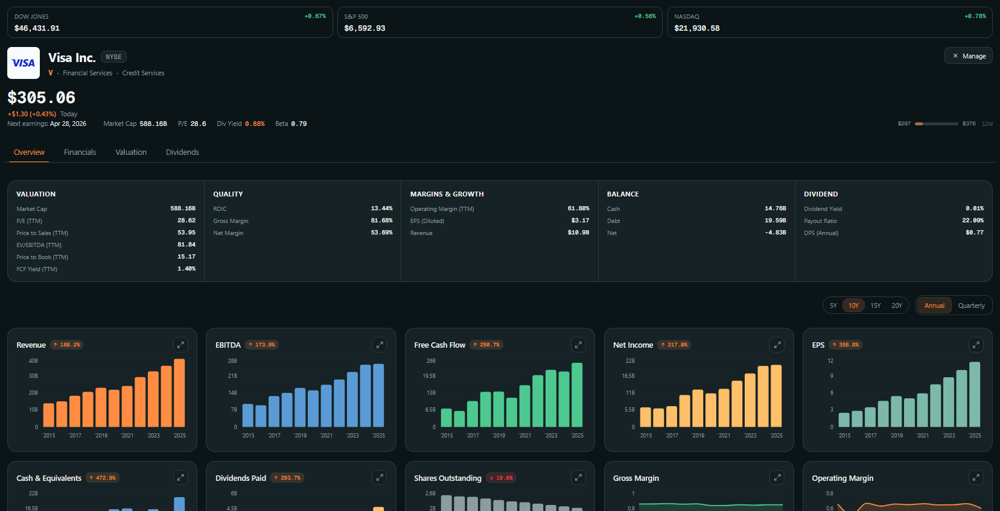
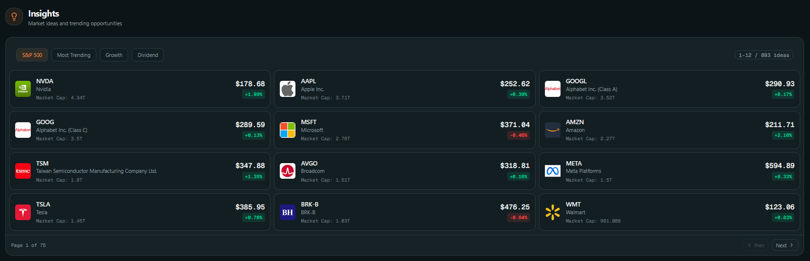
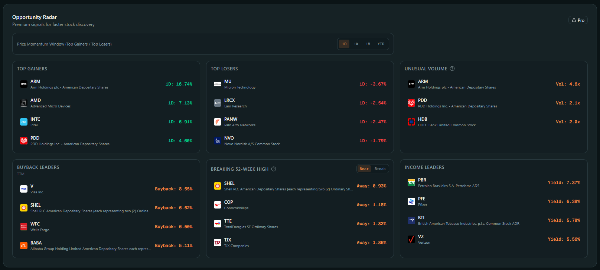
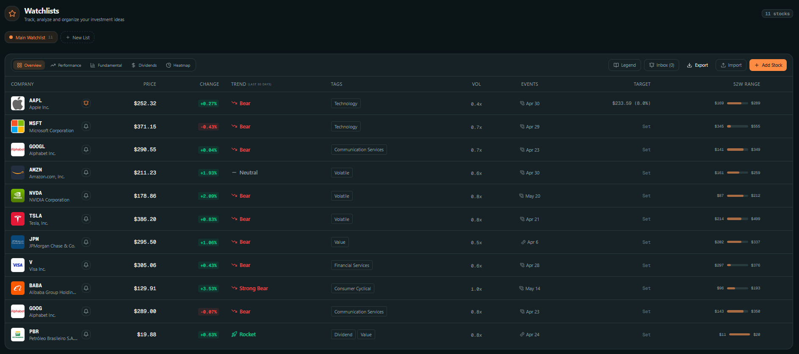
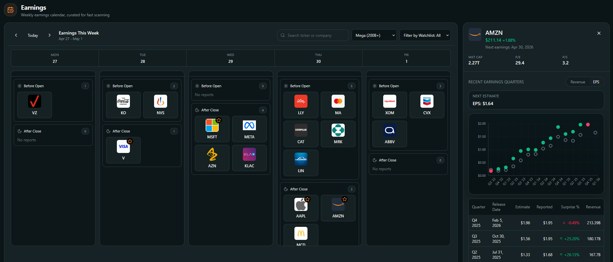
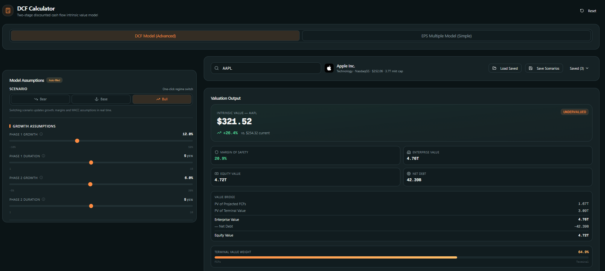
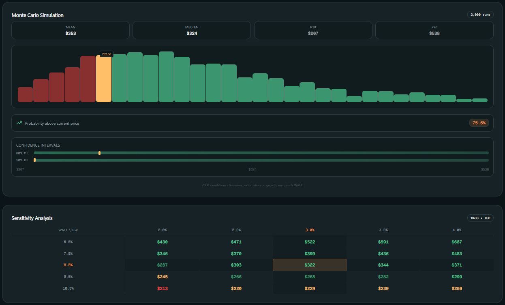
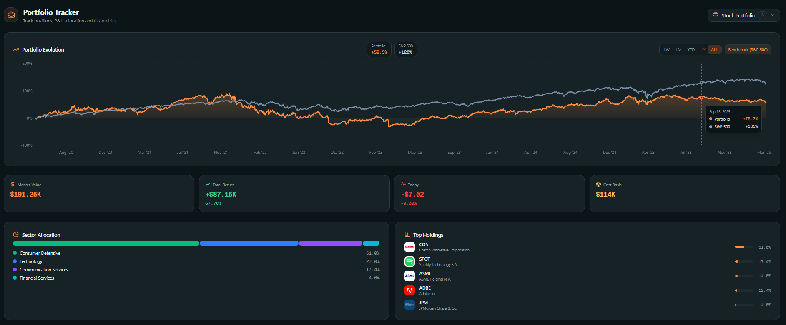

# Huntr

**Live Demo:** [huntrvalue.me](https://huntrvalue.me/)

Huntr is an institutional-grade financial web terminal designed to streamline fundamental analysis and advanced portfolio management for value investors. Built as a fast, visual, and modern alternative to legacy financial software and complex spreadsheets.

## Platform Gallery

## Platform Gallery

<table border="0">
  <!-- 1. Stock Chart -->
  <tr>
    <td colspan="2">
      <p align="center"><b>Main Stock Chart & Analysis</b></p>
      
    </td>
  </tr>
  <!-- 2. Insights -->
  <tr>
    <td colspan="2">
      <p align="center"><b>Market Insights & Trends</b></p>
      
    </td>
  </tr>
  <!-- 3. Opportunity Radar -->
  <tr>
    <td colspan="2">
      <p align="center"><b>Opportunity Radar (Unusual Volume & Buybacks)</b></p>
      
    </td>
  </tr>
  <!-- 4. Watchlist -->
  <tr>
    <td colspan="2">
      <p align="center"><b>Dynamic Watchlists & Market Heatmaps</b></p>
      
    </td>
  </tr>
  <!-- 5. Earnings Calendar -->
  <tr>
    <td colspan="2">
      <p align="center"><b>Weekly Earnings Calendar</b></p>
      
    </td>
  </tr>
  <!-- 6. DCF -->
  <tr>
    <td colspan="2">
      <p align="center"><b>Advanced DCF Calculator (Intrinsic Value)</b></p>
      
    </td>
  </tr>
  <!-- 7. Monte Carlo -->
  <tr>
    <td colspan="2">
      <p align="center"><b>Monte Carlo Simulation & Probability Distribution</b></p>
      
    </td>
  </tr>
  <!-- 8. Portfolio -->
  <tr>
    <td colspan="2">
      <p align="center"><b>Portfolio Performance & Risk Metrics</b></p>
      
    </td>
  </tr>
</table>

## Key Features

Huntr consolidates multiple financial workflows into a single, dark-themed, highly responsive interface:

*   **Advanced DCF Calculator:** Project intrinsic value using dynamic free cash flow models. Features real-time sliders for WACC, terminal growth, and FCF margin assumptions.
*   **Opportunity Radar:** Market-wide scanning for actionable signals, including unusual volume, massive share buybacks, 52-week high breakouts, and income (yield) leaders.
*   **Earnings Hub:** A complete visual history of company earnings. Uses complex scatter and bar charts to plot the last 16 quarters of EPS and Revenue (Estimate vs. Actual) for instant historical context.
*   **Professional Portfolio Tracker:** Tracks Realized and Unrealized P&L. Calculates weighted portfolio metrics such as Beta, P/E ratio, and estimated dividend income. Includes a Time-Weighted Return (TWR) performance chart benchmarked against the S&P 500.
*   **Dynamic Watchlists:** Multi-tab asset tracking covering performance, fundamental ratios, dividend sustainability, and market-cap weighted heatmaps.
*   **Earnings Transcripts:** Long-form, distraction-free reading experience for earnings calls with speaker diarization (Management vs. Analysts).

## Tech Stack

This project is built with modern web technologies, focusing on performance and complex data visualization.

**Frontend:**
*   Framework: React / Next.js
*   Styling: Tailwind CSS
*   Data Visualization: Recharts (Custom composed charts for financial data)

**Backend & Infrastructure:**
*   Database & Authentication: Supabase (PostgreSQL)
*   Transactional Emails: Resend (Custom SMTP)
*   Hosting & CI/CD: Vercel

**Financial Data Providers:**
*   Alpha Vantage
*   Yahoo Finance API
*   Financial Modeling Prep (FMP)

## Getting Started

To run this project locally, you will need Node.js installed on your machine and active API keys for the financial data providers.

1. **Clone the repository:**
   ```bash
   git clone https://github.com/igarridosi/Huntr.git
   cd Huntr
   ```

2. **Install dependencies:**
   ```bash
   npm install
   # or yarn install
   ```

3. **Environment Variables:**
   Create a `.env.local` file in the root directory and add your API keys and Supabase credentials. Example:
   ```env
   NEXT_PUBLIC_SUPABASE_URL=your_supabase_url
   NEXT_PUBLIC_SUPABASE_ANON_KEY=your_supabase_anon_key
   ALPHA_VANTAGE_API_KEY=your_alpha_vantage_key
   FMP_API_KEY=your_fmp_api_key
   RESEND_API_KEY=your_resend_api_key
   ```

4. **Run the development server:**
   ```bash
   npm run dev
   # or yarn dev
   ```
   Open[http://localhost:3000](http://localhost:3000) with your browser to see the result.

## Feedback & Feature Requests

Huntr is currently in Private Beta. If you have access and want to report a bug or request a new financial metric, please use our [Feedback Form](https://tally.so/r/your-form-id) inside the application.

## License

All rights reserved. Copyright (c) 2026 igarridosi.