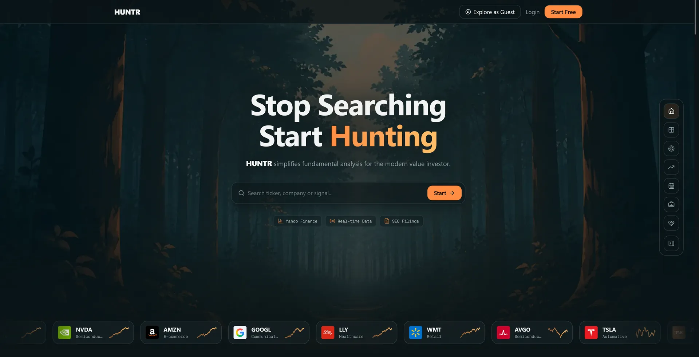
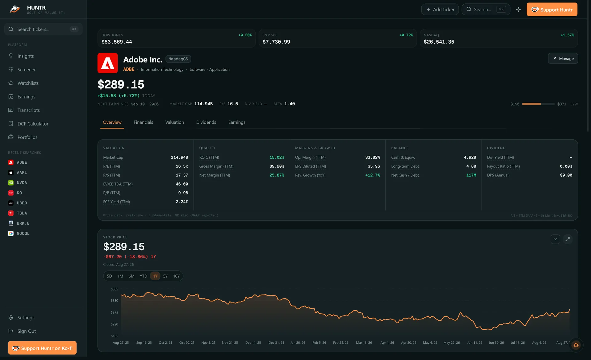
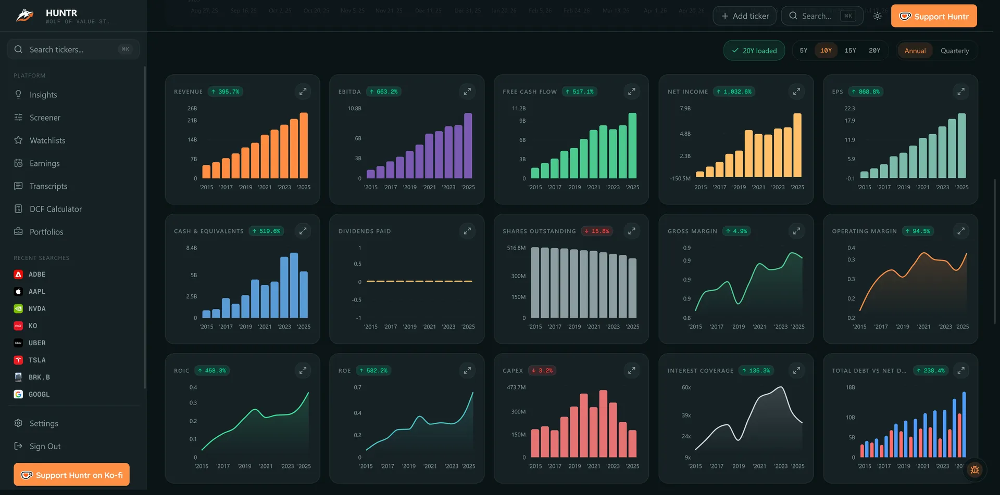
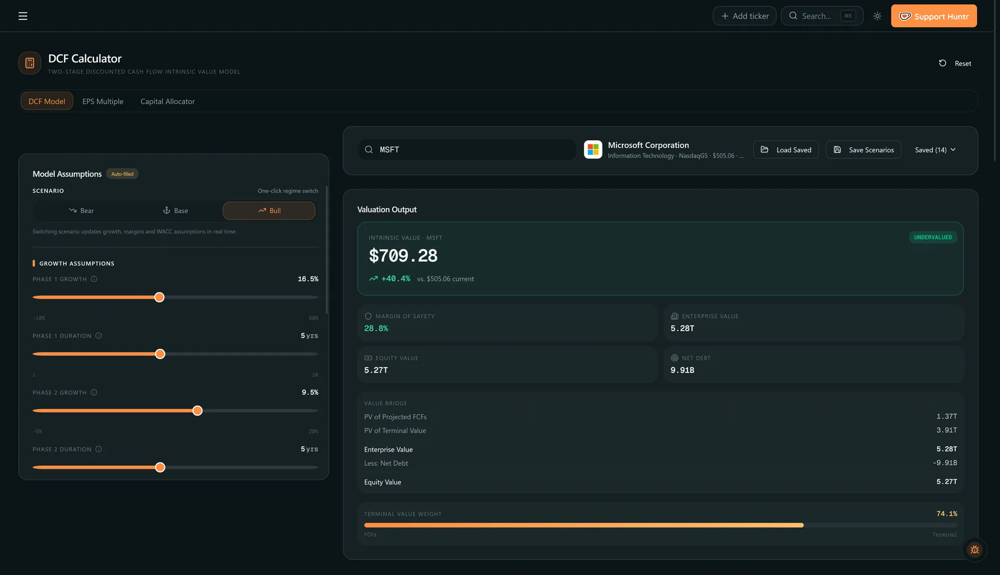
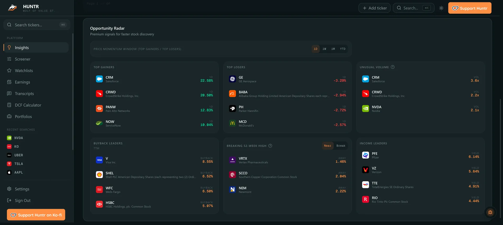
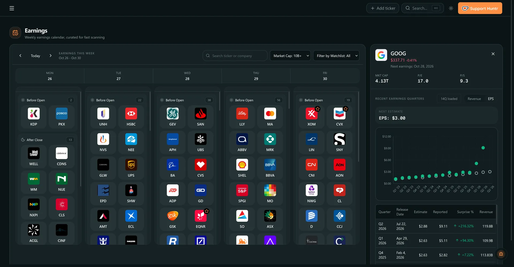
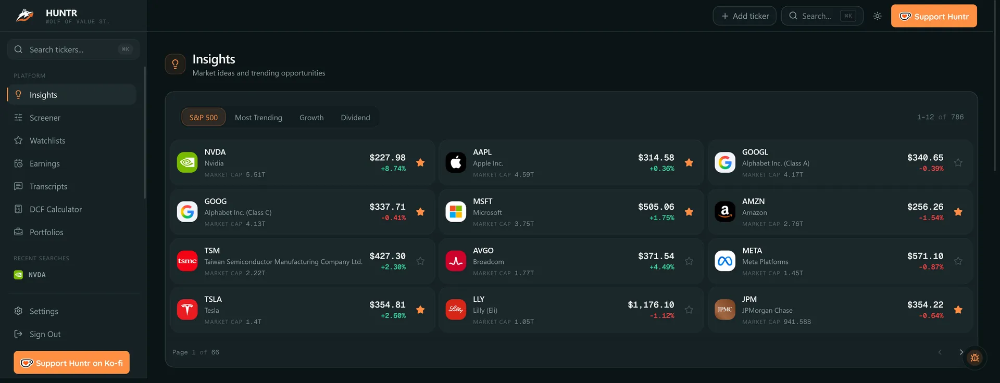
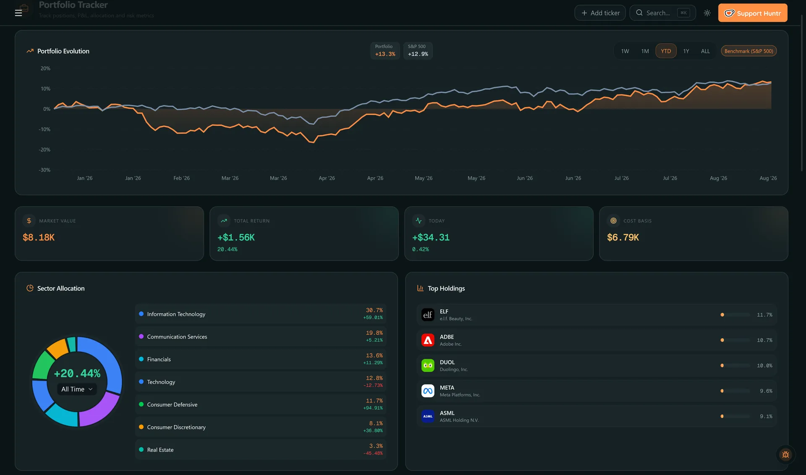
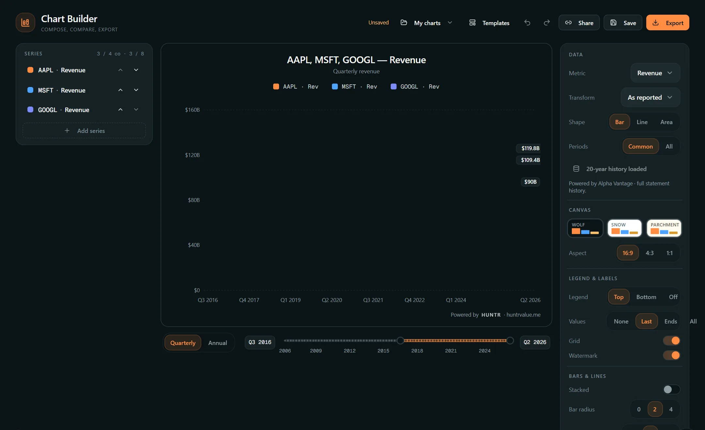

# Huntr

[](https://github.com/igarridosi/Huntr/actions/workflows/ci.yml)

Live at [huntrvalue.me](https://huntrvalue.me/).

Huntr works out what a company is actually worth and tells you whether today's price is cheap or expensive. It is built for people who invest in individual companies and want to check the numbers themselves instead of trusting a headline multiple.

<table>
  <tr>
    <td width="50%"></td>
    <td width="50%"></td>
  </tr>
  <tr>
    <td width="50%"></td>
    <td width="50%"></td>
  </tr>
  <tr>
    <td width="50%"></td>
    <td width="50%"></td>
  </tr>
  <tr>
    <td width="50%"></td>
    <td width="50%"></td>
  </tr>
  <tr>
    <td width="50%"></td>
    <td width="50%"></td>
  </tr>
</table>

## What's inside

- DCF calculator with bear, base and bull scenarios, a Monte Carlo simulation over them, and a reverse DCF that solves for what the market price already assumes.
- A diagnostics panel that refuses to show a valuation when the data cannot support one: mismatched currencies, a share count that does not reconcile with the market cap, a debt figure that was never found.
- Ticker pages with financial statements, dividends, earnings history and call transcripts.
- Chart Builder: compare up to four companies on any of 49 metrics — or contrast two metrics of one company on two axes — with periods aligned by calendar quarter, a period slider, three canvas themes, a shareable link and PNG export.
- Opportunity radar: unusual volume, buybacks, 52-week breakouts, yield leaders.
- Screener over 800+ tickers with a quality score computed weekly.
- Portfolio tracker with realised and unrealised P&L, time-weighted return against the S&P 500, and a rebalance advisor.
- Watchlists with price alerts, target prices and notes.
- JSON export of a full valuation, built so the three scenarios can be handed to an AI model for a second opinion.

## Stack

Next.js 16 (App Router, Server Actions), TypeScript strict, Supabase (Postgres, Auth, Row Level Security), TanStack Query, Recharts, Tailwind v4, Vitest. Deployed on Vercel with two weekly cron jobs. Market data comes from Yahoo Finance through `yahoo-finance2`, from SEC EDGAR for balance-sheet figures, and from Alpha Vantage where a key is configured.

## Testing

```bash
npm test
```

306 tests across 16 files, running in about two seconds with no network access. They cover the DCF engine, the Monte Carlo sampler, the reverse DCF solver, net-debt integrity across scenarios, SEC EDGAR extraction (debt cascades, restricted cash, share-count selection), currency and data-quality guards, scenario coherence, and the cache guards that stop an empty response from being stored.

The financial logic lives in `src/lib/calculations` as pure functions that take numbers and return numbers. Nothing in there fetches, renders or touches a database, which is why every test runs against literal inputs and why the export invariants (the same net debt, share count and price in all three scenarios) can be asserted on the actual file a user downloads.

## Architecture and decisions

- Market data goes through Server Actions rather than public API routes. Every call is a Server Action (`src/app/actions/stock.ts`). The `yahoo-finance2` client and the API keys never leave the server, ticker inputs are validated against a strict pattern before use, and there is no public endpoint to scrape or abuse. The only route handlers are the two cron jobs, and those require a bearer secret.
- Data is cached in Supabase and refreshed by weekly crons instead of fetched live. Yahoo throttles, Alpha Vantage has a daily quota, and the screener needs financials for 800+ companies at once. So data is fetched lazily with a 24-hour TTL into a `stock_cache` table, and a Sunday cron pre-warms the whole universe an hour before the quality-score cron reads it. A request never waits on a provider unless the cache has nothing.
- Row Level Security is what makes the public anon key safe. That key ships to the browser, as it must. What makes that safe is that every user-owned table (`watchlists`, `user_portfolio_state`, `user_dcf_scenarios`, and the rest under `supabase/migrations`) carries policies keyed on `auth.uid()`, so a client can only ever read and write its own rows.
- Guests can use almost everything; only writes ask for an account. Browsing tickers, charts and the DCF calculator needs no account; only `/app/settings` is protected at the middleware. Saving a watchlist, a portfolio or a scenario opens a sign-up prompt that says what the account is for. People can try the product before deciding whether to trust it with their data.
- Yahoo is the primary source, with Alpha Vantage and SEC EDGAR as enrichment. Yahoo covers quotes, profiles and statements for every ticker without a key. Alpha Vantage's statements are treated as authoritative when they are already cached, and are never fetched inside a request. SEC EDGAR is read directly for the figures that decide a valuation: debt, cash, share count, leases, with the cover-page count checked against the market cap.
- The valuation blocks rather than warns when its inputs cannot support it. A wrong unit or a missing figure produces a plausible number, and a plausible number gets acted on. So the model blocks: a JPY balance sheet against a USD price shows no valuation, a debt figure that resolved to nothing holds the calculation until it is entered or confirmed as zero, and an upside past +300% is treated as a broken input rather than an opportunity.

## Running it locally

```bash
cp .env.example .env
npm ci
npm run dev
```

`.env.example` lists every variable the code reads and says which ones are required. With only the two Supabase values set, the app runs and the data views fall back to their empty states.

With Docker:

```bash
cp .env.example .env
docker compose up --build
```

The compose file targets a hosted Supabase project; there is no local database to stand up.

## Status

Public beta with guest access. Bugs and requests go through the [feedback form](https://tally.so/r/XxEBqz), also reachable from inside the app.

## License

MIT. See [LICENSE](LICENSE).

---

This project is developed with help from AI coding agents; their instructions live in [`docs/ai/`](docs/ai/).
