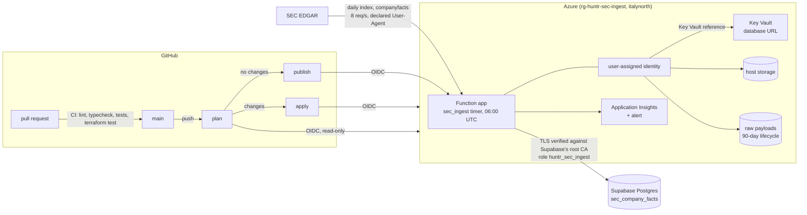

# SEC EDGAR ingest: project report

A nightly job loads the financial facts of every company in Huntr's universe
from SEC EDGAR into Huntr's Supabase database. It runs on Azure Functions,
is deployed with Terraform and GitHub Actions, and has no long-lived
credential anywhere. It was built between 2026-09-28 and 2026-10-01, in
pull requests #35 to #51, and loaded its first full universe on 2026-10-01.

How to run, deploy and operate it is in
[`pipelines/sec-ingest/README.md`](../../pipelines/sec-ingest/README.md).
This report covers what was built, why it was built that way, what went
wrong on the way, and what it costs.

## Status

### In production

- **The nightly run.** A timer function, `sec_ingest`, runs on Azure
  Functions Flex Consumption (`italynorth`, Node 22, one instance of
  512 MB) every day at 06:00 UTC.
  - **First run:** a full load of every company.
  - **Later runs:** incremental. Each run reads the EDGAR daily indexes
    since its cursor and fetches only the companies that filed, are new to
    the universe, or still owe a filing.
- **Writes.** Facts go to Postgres (`sec_company_facts`, `sec_ingest_state`,
  `sec_ingest_cursor`) through Supabase's pooler, as a dedicated role.
  The raw `companyfacts` payloads go to Blob Storage, gzipped, and are
  deleted after 90 days.
- **The full load of 2026-10-01:** 891 companies, 191,332 rows, 33 MB,
  0 errors. The figures are under [The first full load](#the-first-full-load).
- **Infrastructure as code.** Terraform 1.16 (azurerm and azapi) holds its
  state remotely, in a blob locked by lease. Its tests run in CI with
  mocked providers.
- **Deployment.** GitHub Actions authenticates through OIDC, with three
  identities and three environments. Only infrastructure changes need an
  approval. See [Identities and the accepted risk](#identities-and-the-accepted-risk).
- **Monitoring.**
  - Structured JSON logs and a `run.summary` line per run go to Application
    Insights, whose ingestion is capped at 0.1 GB a day.
  - One hourly Azure Monitor alert fires when an invocation fails, and sends
    an email.
  - The run fails, and so alerts, in four cases:
    - EDGAR refuses the requests;
    - at least max(5, 10%) of the companies fail;
    - a company has owed a filing for 5 days;
    - the cursor is more than 4 days old.
- **Database hardening (migration 013).** It is part of the same work. The
  application's shared cache tables could be written by the public API
  roles. Now only the server writes them, through its service client.

### Tested only locally or in a dry run

- **Integration tests against Postgres and Blob.** Postgres sits behind
  PgBouncer in transaction mode, like Supabase's pooler, and Blob Storage is
  Azurite. They run on a developer machine (`npm run test:local`), not in
  CI.
- **The incremental path at scale.** Its logic is covered by unit tests
  against a fake EDGAR: pending filings, give-up after 5 days,
  idempotent reruns, and the cursor moving over weekends. In production,
  the 2026-10-01 load was a full one. The nightly incremental runs that
  follow are what will exercise it for real.
- **`destroy`.** The workflow supports it behind the apply's approval. It
  has never been run.
- **The dry run.** It writes to disk only (`npm run dry-run`) and was used
  to measure rows per company and bytes per row before the first cloud
  run. The first cloud run itself was blob-only on 2026-09-30, for 9
  companies.

### Not done

- **The application does not read `sec_company_facts` yet.** It still
  fetches EDGAR live through the same shared parser. Switching it to the
  table is the next step, and the reason for the table.
- **The table holds 3 years; the app's comparison shows 20.** Serving the
  app from the table means widening the window, and the table grows with
  it.
  - The load of 2026-10-01 left out 875,738 rows for being older than the
    window. Those are rows from reviewed forms that passed every other
    check, so they are exactly what a wider window would add.
  - EDGAR's XBRL history starts around 2009, so 20 years takes in all of
    it: about 191,332 + 875,738 ≈ 1.07 million rows.
  - At today's 181 bytes per row, indexes included (33 MB for 191,332
    rows), that is about 185 MB. This is nearly twice the 100 MB set aside
    on Supabase's free plan, and over a third of the whole 500 MB database.
  - That needs a decision before the switch. One option is to keep only
    the latest filing for each period; another is to keep long history
    for annual figures only; a third is a larger plan.
- **A CI job with a Postgres service** for the integration tests. It is
  estimated at half a day to a day.
- **Rate limiting** of the Server Actions that spend third-party API quota,
  such as `fetchAlphaFinancials`. It is in the backlog.
- **Cleaning the app's `tickers` table.** The changed tickers, the
  deregistered companies, and the preferred shares and notes are listed
  with EDGAR evidence, and a SQL script is ready. Whether to apply it is
  still being decided.

## Architecture

- **One parser.** The SEC parsing (`src/lib/sec/`) is shared by the
  application and the pipeline. A permanent equivalence test runs the
  parser against golden fixtures, so the two cannot drift. The pipeline's
  ingest logic does not depend on Azure: the same code runs as a CLI, as
  the Azure Function and in the tests, through small interfaces for state,
  facts and raw payloads.
- **Configuration from the environment.** `src/config.ts` builds a run from
  the environment, the same way for the CLI and the Function.
  - `SEC_INGEST_MODE=real` writes to Postgres and Blob.
  - `blob-only` was the first cloud stage.
- **What a run loads.**
  - **Universe:** the active rows of the app's `tickers` table, resolved to
    CIKs with EDGAR's `company_tickers.json` and deduplicated by CIK.
  - **Window:** facts from the reviewed forms (10-K, 10-Q, 20-F, 40-F and
    their amendments), within a 3-year window.
  - **Writes:** each company is upserted in one transaction. The upsert is
    idempotent: the same day read twice leaves the same rows.

## Key decisions

- **No storage keys, anywhere.** Shared-key access is disabled on every
  storage account. The function reaches its host storage, its raw
  container and Key Vault with a user-assigned managed identity.
  - The azurerm provider's Flex Consumption resource always writes a plain
    `AzureWebJobsStorage` connection string. That string overrides the
    identity settings and makes the host try a key the account refuses.
  - So the function app is managed with `azapi_resource`
    (`Microsoft.Web/sites`), which sends exactly the settings in the
    configuration. A Terraform test and a deploy check make sure no plain
    connection string comes back.
- **OIDC, never a client secret.** Each GitHub environment trusts one app
  registration through a federated credential. The credential uses
  GitHub's immutable subject format (owner and repository IDs), so a
  renamed repository cannot inherit the trust.
- **Approval only where infrastructure changes.** A read-only plan always
  runs. An apply that needs approval runs only when the plan has changes.
  When it has none, a publish job deploys the code with an identity
  limited to the function app.
- **Supabase's CA, pinned.** The pooler's certificate chains to *Supabase
  Root 2021 CA*, which is not in the public trust stores. The certificate is
  committed (`infra/sec-ingest/certs/`), checked against its SHA-256
  fingerprint in the tests, and passed to the function as a setting. TLS
  is verified, not merely enabled.
- **A pinned version of the database URL.** The URL lives only in Key Vault.
  The app setting is a Key Vault reference that names the secret's
  version, so a rotation is a reviewed change and is never left to a
  cache. See [the first full load's incident](#incidents-and-fixes).
- **A least-privilege database role.** `huntr_sec_ingest` can write only
  the pipeline's tables and read only two columns of `tickers`. Its
  password was set as a SCRAM verifier generated on the developer's
  machine, so the plaintext never reached the SQL Editor, the chat or the
  repository.
- **Row Level Security (migration 013).** The pipeline's tables have RLS,
  with no access for the public API roles. The same review found that the
  app's shared cache tables accepted writes from those roles; they no
  longer do.
- **What a company owes is kept on the company.** A filing in the daily
  index that `companyfacts` does not carry yet, or a failed download, is
  recorded per company and retried every night. The cursor moves on. After
  5 days the company is flagged and the run alerts.
- **No retries of the invocation.** Neither the function nor `host.json`
  retries a failed run, and a test enforces it. The next night, and the
  per-company retries, do that work without hitting EDGAR and Postgres
  again minutes later.
- **A good EDGAR citizen.** Every request declares a User-Agent with a real
  contact address, and the run makes at most 8 requests a second against
  EDGAR's limit of 10. A refusal stops the run instead of retrying into a
  block.

## Identities and the accepted risk

| Job | Environment | Approval | Identity and roles |
|---|---|---|---|
| `plan` | `productionAzurePlan` | none | Reader on the resource group, Storage Blob Data Reader on the `tfstate` container |
| `apply` | `productionAzure` | required | Contributor on the resource group, and Role Based Access Control Administrator limited by a condition to three data roles for service principals |
| `publish` | `productionAzurePublish` | none | Website Contributor on the function app only |

- **The plan cannot write.** It has no write role in Azure or on the state,
  and no action that returns keys or setting values. It plans with
  `-lock=false`, and the apply plans again with the lock. The apply goes
  ahead only if that plan is identical to the one shown.
- **All three environments deploy from `main` only.**
- **Accepted risk.** When the infrastructure does not change, code reaches
  production without an approval, and Website Contributor could also
  change the function app's settings. Two things mitigate it:
  - `main` is protected by a ruleset: a pull request is required (with no
    reviews: a one-person project), the check
    `lint · typecheck · test · build` must pass, force pushes and deletion
    are blocked, and nobody can bypass it.
  - Before publishing, a check compares the live app settings with
    Terraform's and stops the deploy on any difference.

  The `terraform` CI check is deliberately not required. It only runs on
  pull requests that touch `infra/`, and requiring it would block the
  others. Infrastructure changes still need the apply's approval.

## The first full load

The automatic run of 2026-10-01 at 06:00 UTC, from `run.summary` and from
queries on the database:

| | |
|---|---|
| Companies loaded | 891, all without error, none pending |
| Rows in `sec_company_facts` | 191,332, all inserted |
| Size of `sec_company_facts`, with indexes | 33 MB, a third of the 100 MB set aside for it on Supabase's free plan |
| Rows left out | 19,521 from forms that are not reviewed; 875,738 older than the 3-year window; 0 malformed |
| Raw payloads in Blob | 881 written, 176 MB gzipped (176,461,197 bytes, the compressed size; the 9 already there from the blob-only stage are not counted) |
| Requests to EDGAR | 895 |
| Duration | about 10 minutes |
| Alerts | none |

**How the 918 active tickers add up:**

| | Count |
|---|---|
| Companies loaded, one per CIK | 891 |
| Tickers sharing a CIK with a loaded one, so no extra download (ACGLO, BBDO, CMCSA, FOXA, FWONK, GOOGL, NWSA, SOJC, TBB, ZG) | 10 |
| Tickers EDGAR does not resolve | 17 |
| **Total** | **918** |

- **The 17 unresolved,** each checked against EDGAR. The evidence is in
  pull request #48 and the README:
  - BRK.B: a dot where EDGAR writes a hyphen. It is resolved since #48.
  - BK, PSTG, SATS and EQR: tickers that changed, with the same company
    and CIK.
  - AVB, BLD, CFLT, CTRA, EA, EXAS, HOLX and WBS: companies that
    deregistered with Form 15 in 2026.
  - AXIA and CUK: delisted and deregistered.
  - FITBI: a preferred share.
  - LRLCY: a foreign company that files nothing with the SEC.
- **IBN.** One of the 891, IBN (ICICI Bank), has no `companyfacts`: its
  latest 20-F carries no XBRL. It is recorded without an error and has no
  raw payload, which is why there are 890 payloads for 891 companies.
- **The estimate.** Before the load, a sample of 9 large companies measured
  268 rows per company, which put the table at about 46 MB. The real
  average is 215 rows per company: the sample had longer histories than
  the universe.

## Incidents and fixes

| What happened | Cause | Fix |
|---|---|---|
| A Vercel build failed on the writers' PR (#40) | The root `tsconfig.json` included `pipelines/`, whose dependencies the app does not install | The app excludes `pipelines/`, which got its own `tsconfig` and its own CI install and typecheck |
| The bundle failed to load (ESM against CommonJS) | Some dependencies `require()` Node built-ins; the Azure SDK reads `import.meta.url` | An ESM bundle with a `createRequire` banner; `@azure/functions-core` left external |
| The deployed function failed with 403 AuthenticationFailed | azurerm's Flex resource writes a plain `AzureWebJobsStorage`, which overrides the identity settings | The function app moved to `azapi_resource` through `import` and `removed` blocks, without recreating it; a test and a deploy check guard against it |
| The deploy uploaded the binary Terraform plan as an artifact of a public repository | The binary plan holds sensitive values in clear, including the Application Insights connection string | Only the masked `plan.txt` is kept. The apply plans again and compares it with that file. The old artifact was deleted. Impact: that connection string lets its holder send telemetry to Application Insights, not read any; at worst, fake logs or a false alert. It was not rotated: an Application Insights resource's key cannot be regenerated, only replaced with a new resource, and the exposure, on 2026-09-30 until the artifact was deleted and open only to signed-in GitHub users, did not justify that |
| The documentation and the code disagreed on when to give up on a filing | The check said "more than 5 days" | One rule, at least 5 calendar days (the sixth nightly attempt), in code, tests and docs (#37) |
| The first real run failed: the CA setting held no certificate | The committed PEM had 22 lines of command output after the certificate | A clean PEM with the same fingerprint, a parser that keeps only certificate blocks, and tests on the committed file and its fingerprint (#46) |
| *Run once* called `https:///admin/...` | `az functionapp show --query defaultHostName` came back empty for the Flex app | The host is read from ARM's `properties.defaultHostName`, with clear errors (#46) |
| After the CA fix, the run failed with the driver's "Invalid URL" | The reference had no version, and the platform kept serving a cached old version of the secret: 23 characters, not a URL. `configreferences` said `Resolved`, and restarting did not help | A temporary setting, added once in the portal, forced a reload, and the 06:00 run loaded everything. Permanent fix: a pinned secret version, so a rotation is a reviewed change (#51), and errors that name the part of the URL that is wrong, never the value (#47) |
| One company was named by its notes' ticker (Comcast as CCZ), and BRK.B did not resolve | The first ticker alphabetically named the company; EDGAR writes share classes with a hyphen | The ticker EDGAR lists first for the CIK names it, and dotted classes are looked up with a hyphen (#48). State is keyed by CIK, so a new name reloads nothing |
| Every merge waited for an approval, and the publish job never ran | A perpetual plan change: Azure reads the service plan id back as `serverfarms`, azurerm writes `serverFarms`, and azapi compares case-sensitively. Azure also adds an App Insights tag | The id is written as Azure returns it, and only that tag is ignored (#50). The next plan said "No changes", and publish ran without approval |
| Two bugs in the deploy's own checks, found by their tests before they shipped | A failed settings listing read as "blob-only" and passed the Key Vault check. Terraform's `replace()` read a slash-wrapped pattern as a regular expression | Both fixed before merging (#49, #50) |

## Cost

- **Azure:** **less than 0.01 EUR accumulated in `rg-huntr-sec-ingest`
  from 2026-09-28 to 2026-09-30**, actual cost from Cost Analysis. The
  subscription is billed in euros.
  - By service: almost all of it is Azure Monitor (the alert rule).
    Storage and Key Vault are under 0.01 EUR each. Functions, App Service
    and bandwidth are 0.00.
  - Cost Management reports with a delay of 24 to 48 hours. The figure
    does not include 2026-10-01 yet, the day of the full load.
  - Expected from here on:
    - one run a day, about 10 minutes at 512 MB;
    - Application Insights capped at 0.1 GB a day;
    - a few hundred MB in Blob Storage, cut by the 90-day lifecycle;
    - Key Vault operations, measured in cents.
  - It is paid from the Azure for Students credit, with no card attached.
    The budget alert, set at 3 EUR, has not fired.
- **Supabase:** the free plan. The table uses 33 MB of the 100 MB set aside
  for it.
- **GitHub Actions:** free for a public repository.

## Numbers for the record

- **Pull requests:** #35 to #51, each reviewed as a diff before its commit.
- **Tests:**
  - 646 unit tests in the repository, 85 of them in the pipeline;
  - 13 integration tests against local Postgres and Azurite;
  - 5 Terraform test runs with mocked providers.
- **Migrations:** 011 to 013 applied by hand in Supabase, each with a
  rollback script in `supabase/rollbacks/`.
